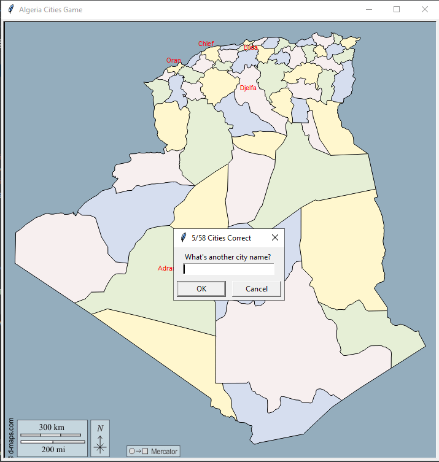
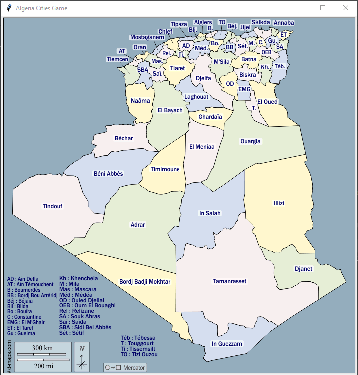

# Algeria Cities Game
A small game build using the **turtle python library**.
The goal of this project is for education purposes, and for having fun.

## How To Play The Game:
you should type the name of the cities that you know and if you typed a correct name then the name of the city will 
print on the map. 

You must know that:

1. if you want to see **the solution** you can just type ``Solution`` which is a map of all the cities in Algeria.

2. if you want to **exit** the game type ```Exit```.

then the game will generate a "missing_cities.scv" file that contain all the missing cities in your answers.


## The Game Looks:


If you type ```solution```:



Have fun!
